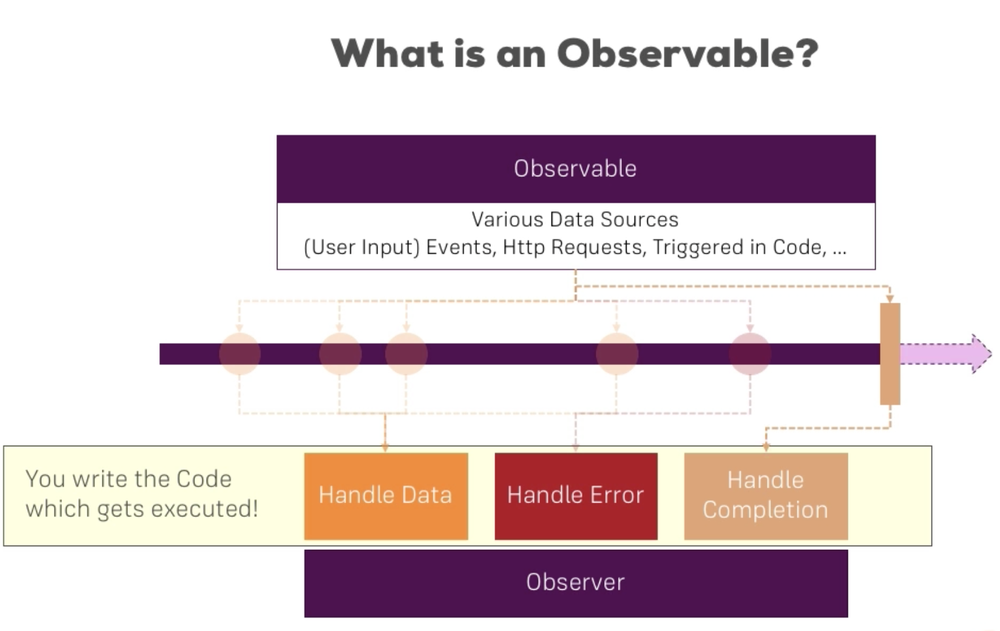
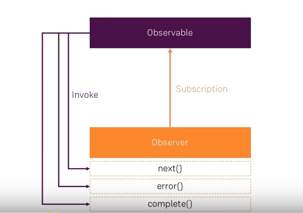
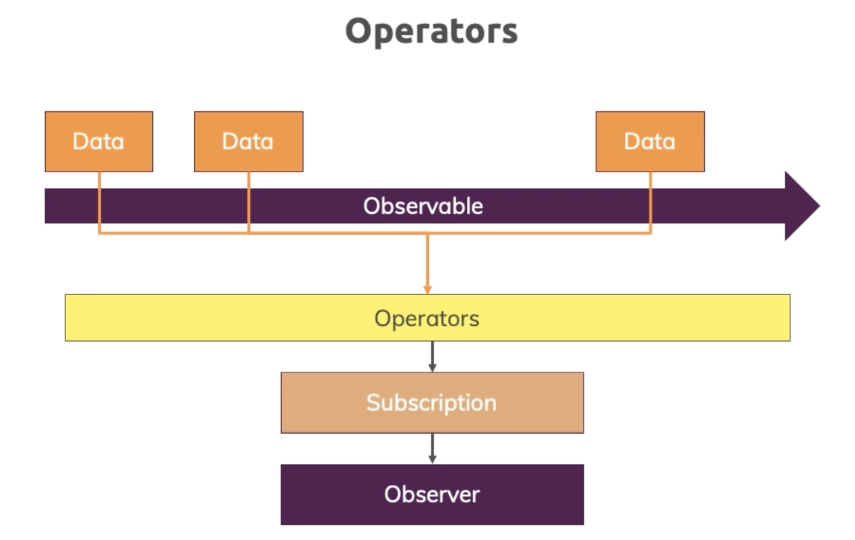

# Observables

**Observable** in Angular is an object imported from third-party library RxJS. It follows the *observable design pattern*.

Angular makes use of observables as an interface to handle a variety of common asynchronous operations. </br>
For example:

* Transmitting data between components;
* The HTTP module uses observables to handle AJAX requests and responses.
* The Router and Forms modules use observables to listen for and respond to user-input events.

## Key Points
* L169: Inroduction
  * [Observable and Observer](#Observable-and-Observer)

* L171: Getting closer to the core of Observables


* Operators
* Subjects

## Observable and Observer

**Observable** is a data source (for instance, button click, http-request and so on). It emits data. </br>
**Observer** it is a subscribe function, it is your code which will be executed at a particular moment (the handlers in the yellow box). 



Observable might emit data like:
* normal data packages which will never complete (for example, click a button: you never know how many time a user may click a button);
* error;
* it may get completed (for example, http-request: it is completed when it gets a response);



With an **observer** we handle async-tasks because all these data sources are *user events*, we don't know when they will happen and how long they will take. 

### Operators
**Operators** are the future of RxJS library, they turn Observable into awesome constructs. 



Operators are used between Observable and Subscription to process data (transform them, filter out and so on). In this way you subscribe to the *result of the operator*. 

There are tons of built-in operators.

### Subjects
Subject is a special kind of Observable, it is provided by RxJS.  

Subject is similar to EventEmitter (provided be Angular) but Subject is recommended way. At the end using Subject is more efficient than EventEmitter.

## L171: Getting closer to the core of Observables

### Subscribe
A simple example of observable [home.component.ts](https://github.com/ebd622/fe-samples/blob/master/observabels/src/app/home/home.component.ts):
```
  ngOnInit() {
    interval(1000).subscribe(count => {
    console.log(count);
    })
    ...
}    
```
`interval` function emits an event every second and this will give us `obserable`, we can subscribe to the observable and log a message. So, a new value will be got every second and will be logged.

### Unubscribe
To prevent a memory leak you need to unsubscribe (not for all observables, but for some of them). For this we need to keep a `subscription` (not observable) in a local variable:

```
export class HomeComponent implements OnInit, OnDestroy {
  private firstObsSubscriprion: Subscription;

  constructor() { }

  ngOnInit() {
    this.firstObsSubscriprion = interval(1000).subscribe(count => {
    console.log(count);
    })
  }
    ...
  ngOnDestroy(): void {
  this.firstObsSubscriprion.unsubscribe();
  }
}    
```
It means whenever we leave the component we clear the subscription and prvent memory leaks because we are not keeping old subscriprion.


## Resourcse
* RxJS: https://rxjs-dev.firebaseapp.com/
* Observables in Angular: https://angular.io/guide/observables-in-angular


