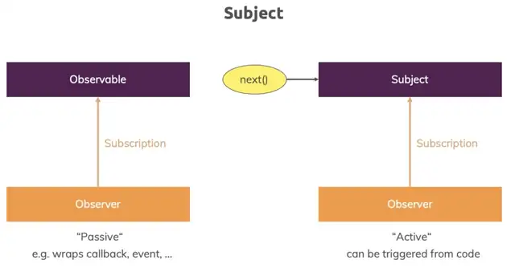

# Observables

**Observable** in Angular is an object imported from third-party library RxJS. It follows the *observable design pattern*.

Angular makes use of observables as an interface to handle a variety of common asynchronous operations. </br>
For example:

* Transmitting data between components;
* The HTTP module uses observables to handle AJAX requests and responses.
* The Router and Forms modules use observables to listen for and respond to user-input events.

## Key Points
* L169: [Inroduction: Observable and Observer](#Observable-and-Observer)

* L171: [Getting closer to the core of Observables](#l171-getting-closer-to-the-core-of-observables)
* L172: [Building a custom observable](#l172-building-a-custom-observable)
* L173: [Errors & Completion](#l173-errors--completion)
* L175: [Understanding operators](#l175-understanding-operators)
* L176: [Subjects]()

## Observable and Observer

**Observable** is a data source (for instance, button click, http-request and so on). It emits data. </br>
**Observer** it is a subscribe function, it is your code which will be executed at a particular moment (the handlers in the yellow box). 


Observable might emit data like:
* normal data packages which will never complete (for example, click a button: you never know how many time a user may click a button);
* error;
* it may get completed (for example, http-request: it is completed when it gets a response);


With an **observer** we handle async-tasks because all these data sources are *user events*, we don't know when they will happen and how long they will take. 


## L171: Getting closer to the core of Observables

#### Subscribe
A simple example of observable [home.component.ts](https://github.com/ebd622/fe-samples/blob/master/observabels/src/app/home/home.component.ts):
```
  ngOnInit() {
    interval(1000).subscribe(count => {
    console.log(count);
    })
    ...
}    
```
`interval` function emits an event every second and this will give us `obserable`, we can subscribe to the observable and log a message. So, a new value will be got every second and will be logged.

#### Unubscribe
To prevent a memory leak you need to unsubscribe (not for all observables, but for some of them). For this we need to keep a `subscription` (not observable) in a local variable:

```
export class HomeComponent implements OnInit, OnDestroy {
  private firstObsSubscriprion: Subscription;

  constructor() { }

  ngOnInit() {
    this.firstObsSubscriprion = interval(1000).subscribe(count => {
    console.log(count);
    })
  }
    ...
  ngOnDestroy(): void {
  this.firstObsSubscriprion.unsubscribe();
  }
}    
```
It means whenever we leave the component we clear the subscription and prvent memory leaks because we are not keeping old subscriprion.


A valid qustion: why there is no need to unsubscribe in this example [user.component.ts](https://github.com/ebd622/fe-samples/blob/master/observabels/src/app/user/user.component.ts):

```
  ngOnInit() {
    // Here "route.params - is observable"
    this.route.params.subscribe((params: Params) => {
      this.id = +params.id;
    });
  }
```
The answer is: Angular does it. </br> 
Angula manages all the observales (including `unsubscribe`) provided by Angular.

## L172: Building a custom observable
A custom observable example [home.component.ts](https://github.com/ebd622/fe-samples/blob/master/observabels/src/app/home/home.component.ts):

```
      // Option 2: create a custom observable
      const customIntervalObservable = Observable.create(observer => {
        let count = 0;
        setInterval(() => {
          observer.next(count);
          if(count === 2) {
            // Complete a subscription
            observer.complete();
          };
          if(count > 3){
            // Generate an error
            observer.error(new Error('Count is greater 3!'))
          }
          count++;
        }, 1000);
      });
```
It is the same logic like in `Option 1` but a custom implementation.

## L173: Errors & Completion
When observable thwrows an error it dies (it will not emit events any more). But it is important to handle errors and also completions ([home.component.ts](https://github.com/ebd622/fe-samples/blob/master/observabels/src/app/home/home.component.ts)):

```
      this.firstObsSubscriprion = observableWithOperator.subscribe(data => {
        console.log(data);
      }, error => {
        // Error handler: This is a plase where you can process an error: send something to back-end and so on
        console.log(error);
        alert(error.message);
      }, () => {
        // Completion handler (no need to unsubscribe in a case of completion)
          console.log('Completed!')
      })
  }
```
Completing can be a normal process in the an observable. The `interval` function by default does't complete, it will emits values until end of time (or until error happens). But, for instance,  HTTP request will complete when a response by a server is there. </br></br>
In a custom observable we can manually complete it calling `observe.complete()` (see [home.component.ts](https://github.com/ebd622/fe-samples/blob/master/observabels/src/app/home/home.component.ts)).</br>
We can react to the completion by calling a function (see `// Completion handler (no need to unsubscribe in a case of completion)`) in the above code.</br></br>
If observable is canceled because of an error, the function `complete()` will not be called! Technically in both cases new values will not be emitted. 

## L175: Understanding operators
#### Operators are the future of RxJS library, they turn Observable into awesome constructs. 


Operators are used between Observable and Subscription to process data (transform them, filter out and so on). In this way you subscribe to the *result of the operator*. 

There are tons of built-in operators.

#### Example
Every observable has a method `pipe()` which may have one or more parameters ([home.component.ts](https://github.com/ebd622/fe-samples/blob/master/observabels/src/app/home/home.component.ts)). Operators are executed one after another.

```
      // Use operators (filters and map) to process data
      const observableWithOperator = customIntervalObservable.pipe(
          filter((data: number) => {
            return data > 0;
      }),
          map((data: number) => {
        return 'Round ' + (data + 1);
      }));
```

## L176: Subjects
Subject is a special kind of Observable, it is provided by RxJS.  

Subject is similar to EventEmitter (provided be Angular) but Subject is recommended way. At the end using Subject is more efficient than EventEmitter.



`Observable` wraps a callback or event or something like that.</br>
`Subject` is active, we can call `next()` on it from outside. It is good to use when we DON'T have a passive event source like HTTP request or DOM events but we have something that needs to be triggered by us in our application (for example, clicking a button).</br>

Create a subject [user.service.ts](https://github.com/ebd622/fe-samples/blob/master/observabels/src/app/user.service.ts):
```
@Injectable({providedIn: 'root'}) // It is a shortcut how to use "provided"
export class UserService {
    activatedEmmiter = new Subject<boolean>()
}
```

## Resourcse
* RxJS: https://rxjs-dev.firebaseapp.com/
* Observables in Angular: https://angular.io/guide/observables-in-angular
* Angular Observable: https://dinhanhthi.com/angular-3-observable/


